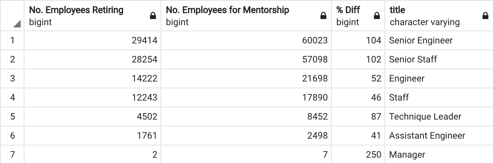

# Pewlett-Hackard-Analysis

## Overview
An HR analyst from Pewlett Hackard has reached out to us to collaborate with him to determine which employees will be retiring in the near future, and how many positions will need to be filled as a result. To prepare for the mass number of soon to be retirees, we also want to establish a mentorship program with the possible employees that will leave. In our analysis, we have grouped these employees by title, number of employees eligible for the mentorship program to present to the hiring leads to make sure the company is prepared for this wave of retiring employees.

## Analysis
1. The first table, retirement_titles, we had to create was for potential retirees organized by birth years from 1952 to 1955 paired with their titles. However, this table listed all the positions the employees have held at the company. So, in order to provide a table with only their most recent titles, we used DISTINCT ON their employee numbers to eliminate the duplicate rows, unique_titles. Our final table, retiring_titles, illustrates the number of retiring employees per title, utilizing COUNT on employee numbers and GROUP BY on titles.

2. Next, we found the employees who would be eligible for the mentorship program. We gathered employees who were born in 1965 and their job titles, which indicated people who still have more years at the company than those who we expect to retire soon . To create the table, we joined three of our existing tables, employees, dept_emp, and titles, with an additional filter to return their most recent position.

## Summary

How many roles will need to be filled as the "silver tsunami" begins to make an impact?

We utilized SUM on the counts column per position in the retiring_titles table.

Are there enough qualified, retirement-ready employees in the departments to mentor the next generation of Pewlett Hackard employees?

We ran two additional queries to gain additional insight on the retirement ready employees and how many employees we have who can help mentor incoming employees.
Our first table compares the number of retiring employees from retiring_titles and the number of eligible mentors from mentorship_eligibility. As shown below, there are far more retiring employees than the number of eligible mentors

Thus, in our second table, we have expanded the range of possible mentors to include more retirement ready employees, and compared them to the retiring employees.

